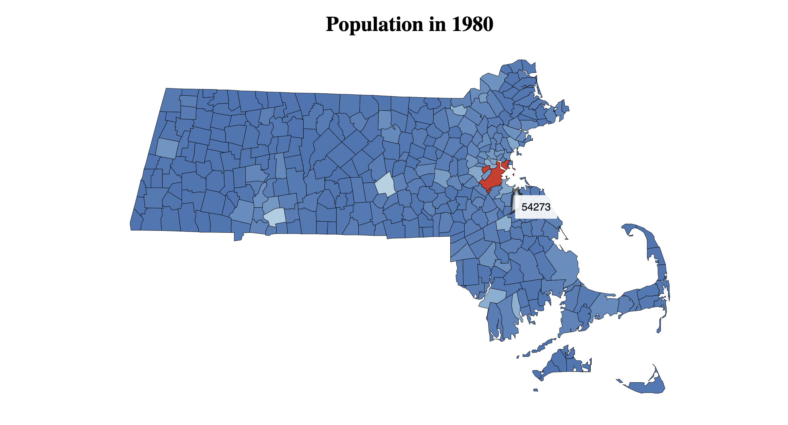
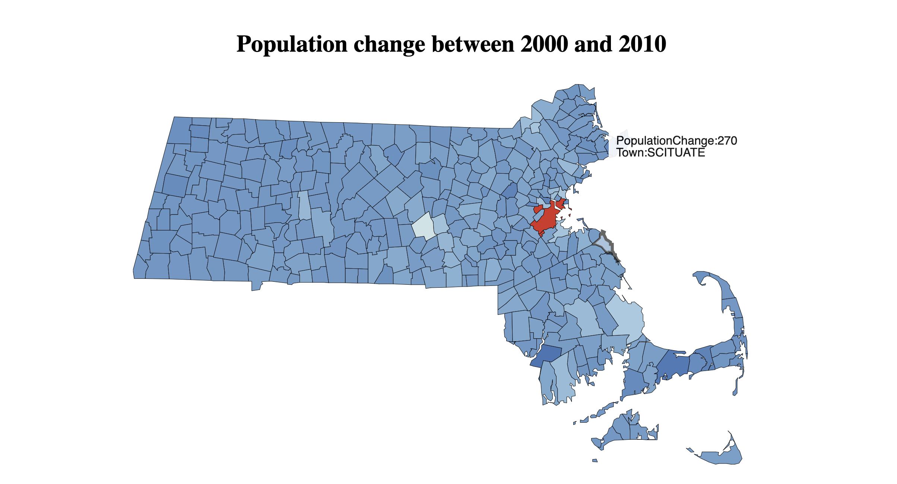
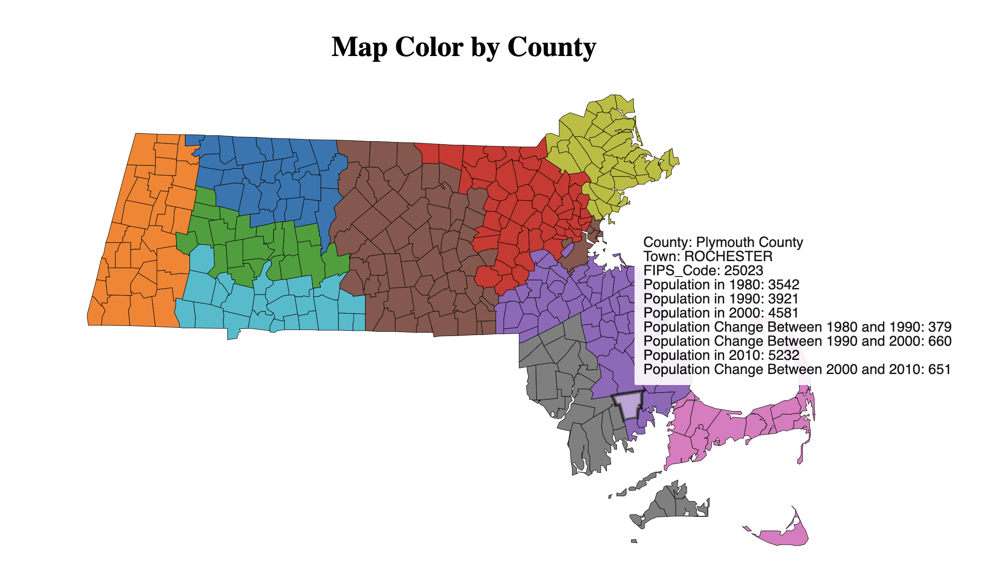
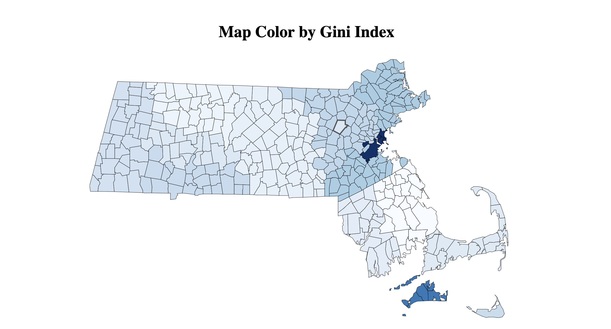

# Massachusetts Geospatial Analysis: Population and Gini Index Visualization

[Link to GitHub Pages](https://jravikumar97.github.io/ma-geospatial-analysis/)

## Overview

This project is a **geospatial visualization tool** for analyzing demographic and socioeconomic data in Massachusetts. It includes four distinct visualizations:

1. **Population in 1980**: A choropleth map showing the population of each town in Massachusetts in 1980.

   

2. **Population Change Between 2000 and 2010**: A map visualizing the population growth or decline in each town between 2000 and 2010.

   

3. **Map Color by County**: A map colored by county boundaries, with details about population changes and county/town data.

   

4. **Map Color by Gini Index**: A map displaying the Gini Index (a measure of income inequality) by county for 2019.

   

The visualizations are created using **D3.js**, and the data is pulled from **CSV and TopoJSON** files that contain detailed demographic information. This project offers interactive elements, such as tooltips displaying detailed data for each county or town when the user hovers over the map.

## Key Features

1. **Interactive Maps**:

   - Users can hover over towns or counties to view detailed information in a tooltip, such as population data, population changes, and Gini index values.
   - Different maps represent different data sets, allowing users to analyze historical population trends and income inequality.

2. **Choropleth Maps**:

   - The maps use color scales to represent data values (population, population change, Gini index) across different regions in Massachusetts.
   - The Gini index map uses a blue color scale to represent income inequality, while population maps use a color interpolation to indicate different values.

3. **Geospatial Data Processing**:

   - The project makes use of **TopoJSON** and **GeoJSON** formats to represent the geographical boundaries of towns and counties.
   - D3.js's projection tools are used to accurately display Massachusetts on the map, applying different map projections.

4. **Tooltip for Data Insights**:
   - When hovering over towns or counties, a tooltip appears, providing detailed information about the selected area, such as population statistics or Gini index values.

## Technologies Used

- **D3.js**: A JavaScript library for producing dynamic, interactive data visualizations in web browsers, using SVG, HTML, and CSS.
- **TopoJSON**: A compact format for encoding geographic data structures.
- **HTML/CSS/JavaScript**: For building the web interface and controlling the layout and styles.
- **CSV**: For handling data such as the Gini index and population statistics.

## Project Structure

```
├── index.html          # Main HTML file for the project
├── script.js           # JavaScript logic for data loading and visualization
├── styles.css          # CSS for styling the webpage and tooltips
├── data/
│   ├── towns.topojson          # TopoJSON file for towns in Massachusetts
│   ├── counties.topojson       # TopoJSON file for counties in Massachusetts
│   ├── gini_index.csv          # CSV data for Gini index values by county
├── screenshots/
│   ├── MapByGiniIndex_Screenshot.png
│   ├── MapColorByCounty_Screenshot.png
│   ├── PopulationChange_ScreenShot.png
│   └── PopulationIn1980_Screenshot.png
```

## How It Works

1. **Data Loading and Processing**:
   - The project loads data from TopoJSON files (for towns and counties) and CSV files (for the Gini index) using D3.js. The data is converted into GeoJSON format for easier handling and rendering on the map.
2. **Map Generation**:

   - Several maps are generated, each using a specific dataset (population, Gini index, or population change). D3’s `geoPath()` function, along with appropriate projections, is used to map the data onto the SVG canvas.

3. **Color Scales**:

   - The maps use different color scales to represent the data:
     - A blue color scale (`d3.scaleSequential(d3.interpolateBlues)`) is used for the Gini index map.
     - A diverging color scale is used for population-related maps to indicate variations in population size or change.

4. **Tooltip Interaction**:
   - When the user hovers over a county or town, a tooltip is displayed with relevant data. The tooltip appears dynamically at the mouse position and is hidden when the user moves away.

## Setup and Installation

1. **Prerequisites**:
   - A modern web browser (Google Chrome, Firefox, etc.).
2. **Running the Project**:
   - Clone the repository:
     ```bash
     git clone https://github.com/jravikumar97/ma-geospatial-analysis.git
     cd ma-geospatial-analysis
     ```
   - Open `index.html` in your browser to view the visualizations.

## Usage

1. **Viewing Population Data**:
   - The first map displays the population in 1980. Hover over any town to see its population in that year.
2. **Analyzing Population Change**:
   - The second map visualizes population changes between 2000 and 2010. The tooltip provides detailed statistics for each town.
3. **County-level Analysis**:
   - The third map colors each town by its respective county. Hovering over a town shows information about population changes across different decades.
4. **Analyzing Income Inequality**:
   - The fourth map visualizes the Gini index for each county in 2019, allowing users to see income inequality across Massachusetts.
